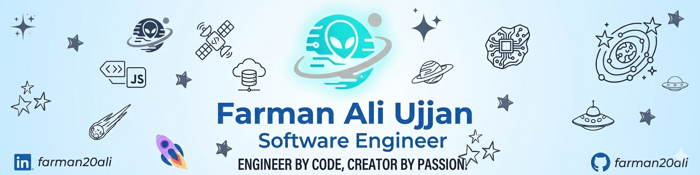

<!-- ===========================
      TOP BANNER
=========================== -->

  

<!-- ===========================
      TITLE & TAGLINE
=========================== -->
<h1 align="center">👋 Hey, I’m Farman Ali Ujjan</h1>

  Software Engineer • Distributed Systems • FinTech Infrastructure • Platform Engineering

  Designing reliable, low-latency backend systems for financial platforms.

  

<!-- ===========================
      BADGE ROW
=========================== -->

  
  
  

 

<!-- ===========================
      IMPACT
=========================== -->
<table align="center">
  <tr>
    <td align="center"><b>3+ years</b> FinTech backend</td>
    <td align="center"><b>1M+ users</b> production scale</td>
    <td align="center"><b>~300ms ➜ ~20ms</b> API latency win</td>
    <td align="center"><b>20+ services</b> microservices built</td>
  </tr>
</table>

<!-- ===========================
      ABOUT ME
=========================== -->
## 🚀 About Me

Software Engineer with **3+ years in FinTech and distributed backend systems**, focused on high-throughput, low-latency services.

I build Java microservices, event-driven systems, and resilient platforms for production environments where correctness, observability, and performance matter.

**Core focus:** distributed systems, payments, observability, and platform engineering.

**Tech keywords:** Java · Quarkus · Spring Boot · Kafka · PostgreSQL · Redis · Docker · ELK

- 🏗️ Design and ship **low-latency microservices** using Java, Quarkus, and Spring Boot
- ⚡ Build event-driven systems with **Kafka**, **Redis**, **PostgreSQL**, and **ELK**
- 🎯 Focus on **clean architecture**, **observability**, and **scalability**
- 🚀 Build open-source developer tools and automation

---

<!-- ===========================
      HIGHLIGHTS
=========================== -->
## ✅ Highlights

- Reduced API response times from **~300ms to ~20ms** using Redis-based caching
- Built and maintained **20+ backend services** across digital banking channels
- Integrated **RAAST** real-time payments and Kafka-based workflows
- Set up **ELK observability** for proactive incident response

---

<!-- ===========================
      SKILLS
=========================== -->
## 🧠 Tech Stack

  
  
  
  
  
  
  

**Languages:** Java, Python, JavaScript, Go (learning), C#  
**Backend:** Quarkus, Spring Boot, Flask, Node.js  
**Mobile/Web:** React Native, React, Vue.js  
**Infra:** Docker, ELK Stack, Redis, Kafka  
**Databases:** PostgreSQL, PostGIS, MySQL, MongoDB, SQL Server, DB2  
**Cloud:** AWS (foundational)  
**Patterns:** Microservices · Event-Driven · CQRS · Resilience · Domain-Driven Design  

---

<!-- ===========================
      HIGHLIGHTED PROJECTS
=========================== -->
## ⭐ Highlighted Projects

### 🚨 Accident Reporting System — End-to-End System Designed & Developed by Me
A complete ecosystem covering mobile app, backend services, AI module, and data access.

#### 🔗 Supporting Repositories (Modules I Built)

- 📌 **Frontend + Mobile App + Core System** —  
  ➜ [IRS](https://github.com/usamazahid/IRS)

- 📌 **LLM / AI Integration Module** —  
  ➜ [llm-code](https://github.com/farman20ali/llm-code)

- 📌 **Backend Data Access Layer** —  
  ➜ [data-access](https://github.com/usamazahid/data-access)

---

### 🛠️ Network Tools (Public & Maintained)

- **NetCheck** — Cross-platform network connectivity diagnostic tool for quick troubleshooting (Available on SnapStore).  
  ➜ https://github.com/farman20ali/network_access_check

- **kport** — Docker-aware CLI for port inspection and debugging.  
  ➜ https://github.com/farman20ali/port-killer

---

<!-- ===========================
      CURRENT GOALS
=========================== -->
## 🎯 Current Goals

- Build more **developer tools** and open-source utilities
- Strengthen **systems design** and **platform engineering** depth
- Launch products powered by **AI + cloud-native architecture**

---

<!-- ===========================
      CONTACT
=========================== -->
## 📫 Connect With Me

- 💼 LinkedIn: **linkedin.com/in/farman20ali**
- 🐙 GitHub: **github.com/farman20ali**
- 🌐 Portfolio: **farman20ali.github.io/portfolio**

---

  Building systems that stay reliable under pressure.

